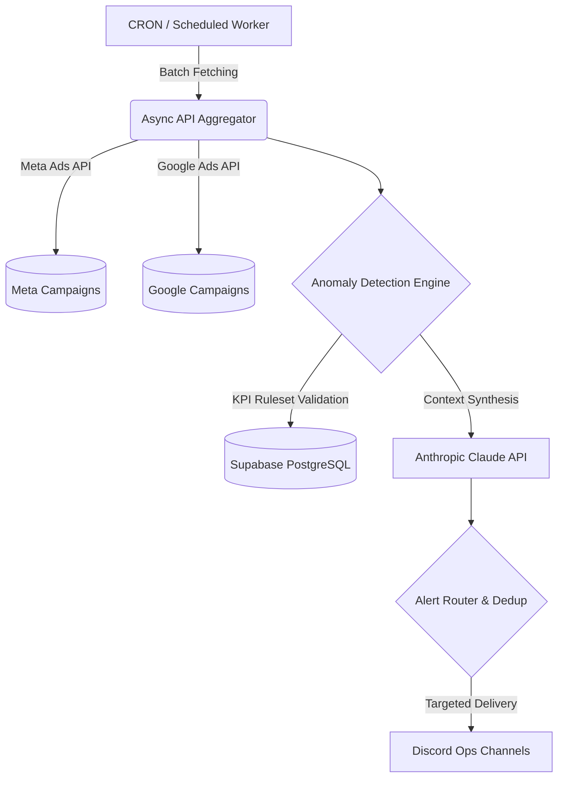

# ⚡ Autonomous AdOps Orchestrator (Agentic PPC Monitor)

[](https://www.python.org/)
[](https://supabase.com/)
[](https://www.anthropic.com/)
[](#)

> **Executive Summary:** An enterprise-grade, asynchronous AI orchestration system designed to monitor, analyze, and route alerts for large-scale B2B and e-commerce advertising portfolios. Currently managing **~5,000 active campaigns** across Meta and Google Ads, this system leverages Anthropic's Claude to transition media buying from reactive dashboard-checking to proactive, AI-driven exception management.

## 💼 The Business Case & ROI

Managing thousands of ad campaigns manually leads to human error, budget bleed, and alert fatigue. This system enforces a **Zero-Waste AdOps Pipeline**:
*   **Intelligent Fault-Isolation:** Partial API failures from Meta/Google do not halt the entire pipeline. Healthy accounts are processed; failing accounts are explicitly flagged.
*   **Algorithmic Alert Routing:** Mitigates alert fatigue via deduplication, strict quiet-hour enforcement (no critical alerts outside business hours), and multi-tenant user routing.
*   **Agentic Insights:** Replaces manual data-pulling with Claude-powered anomaly detection (e.g., sudden ROAS drops, zero-conversion budget burn) on a scheduled Cron basis.

## 🏗️ Architecture & Core Systems

The application is built on a robust, multi-tenant relational data model, executed via a containerized Python worker.



## 🧠 Core Engineering Principles

*   **Cascading KPI Inheritance:** Account-level targets automatically trickle down to thousands of campaigns, with localized overrides permitted for specialized ad sets. Null-safe evaluation ensures only explicitly defined KPIs trigger anomalies.
*   **Strict Pagination & Rate Limit Handling:** Custom paginators engineered to stay under Discord's ~4096-character embed limits and PostgREST's silent 1000-row truncation, ensuring 100% data fidelity for high-volume accounts.
*   **Read/Write Segregation:** Immediate, ad-hoc summary requests (Read) are intentionally isolated from the hourly cron cycle (Write) to prevent alert duplication and database locking.

## ⚙️ Data Model (Simplified)

*   `clients` / `ad_accounts` / `campaigns`: Strict hierarchical multi-tenancy.
*   `assignments` / `account_assignments`: RBAC (Role-Based Access Control) matrix determining alert visibility.
*   `campaign_kpis` / `ad_account_kpis`: Nullable metric boundaries (ROAS, CPA, Spend, CTR).
*   `audit_log`: Immutable ledger for all administrative configuration changes.

## 🚀 Deployment & Safety

This system is currently deployed in a production environment.

*   **Execution:** Containerized via Railway.
*   **Environment:** Relies strictly on injected `.env` secrets. No hardcoded tokens.
*   *(Note: Local Google Ads SDK testing requires Python 3.12 compatibility.)*

## Fejlesztői környezet beállítása

1. Klónozd a repót és lépj be:
   ```bash
   git clone <repo-url>
   cd mymins-ppc-monitor
   ```

2. Hozz létre virtuális környezetet és telepítsd a függőségeket:
   ```bash
   python -m venv venv
   source venv/bin/activate   # Windows: venv\Scripts\activate
   pip install -r requirements.txt
   ```

3. Másold a `.env.example` fájlt `.env` néven, és töltsd ki a kulcsokat:
   ```bash
   cp .env.example .env
   ```

4. Futtasd a Supabase migrációkat (lásd `supabase/migrations/`).

5. Indítsd a botot:
   ```bash
   python -m src.bot.main
   ```

## Projektstruktúra

```
src/
  bot/            Discord bot és slash parancsok
    commands/     Egyes parancs-csoportok
  integrations/   Külső API kliensek (Meta, Google, ClickUp, Claude)
  monitoring/     Monitoring motor és anomália-detektálás
  routing/        Riasztás-célzás (kihez megy az értesítés)
  storage/        Supabase adatbázis-réteg
  utils/          Segédfüggvények (idő, csendes mód, logging)
supabase/
  migrations/     SQL séma-migrációk
scripts/          Egyszeri/karbantartó szkriptek
tests/            Tesztek
```

## Licenc

Proprietary — PlanSmart. Minden jog fenntartva.
